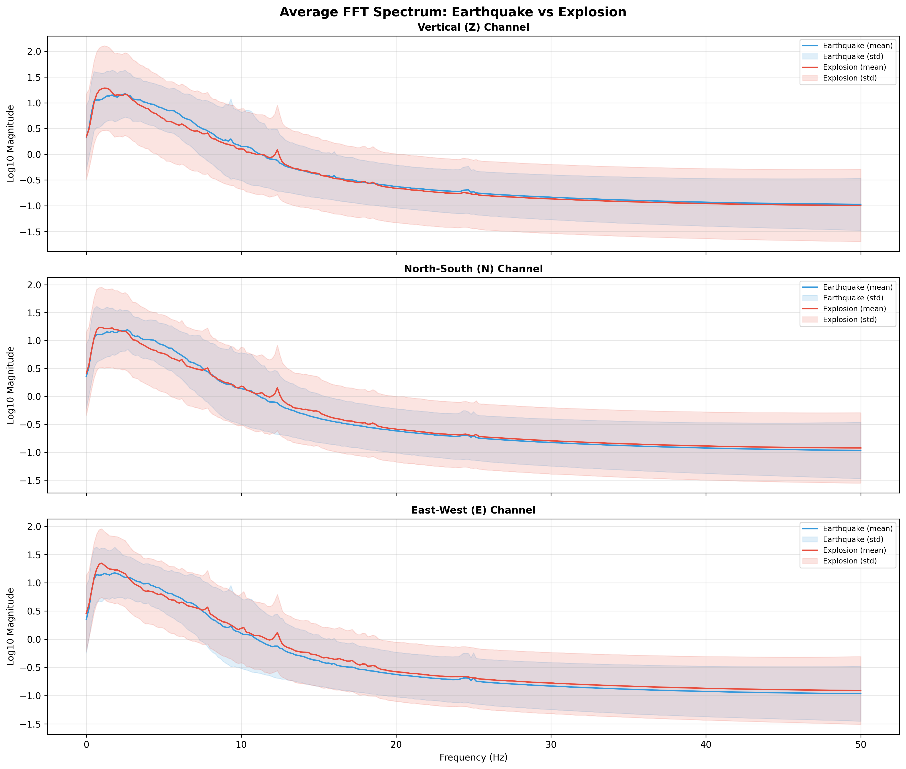
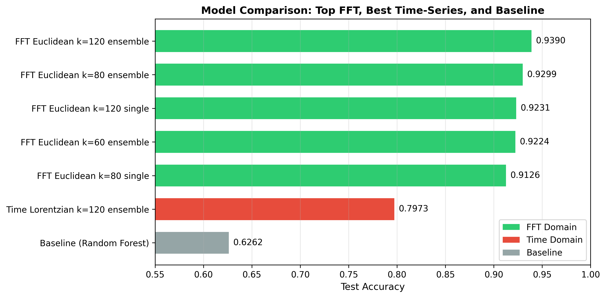
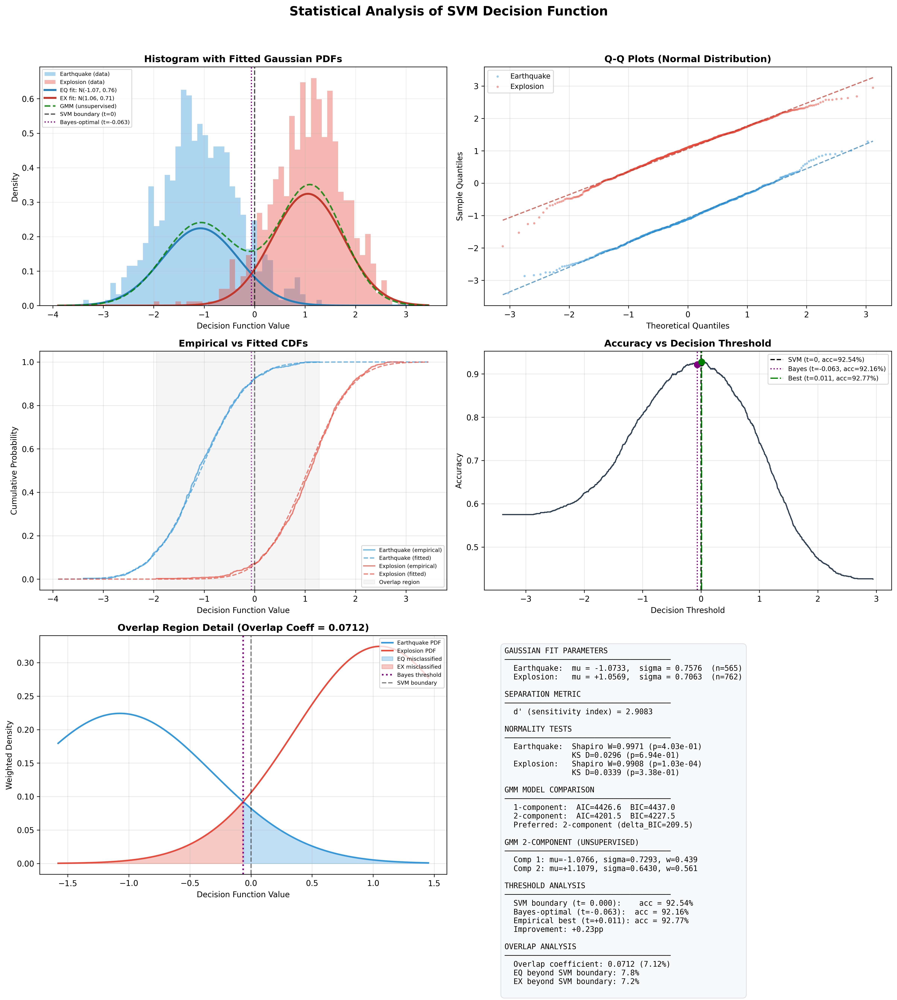
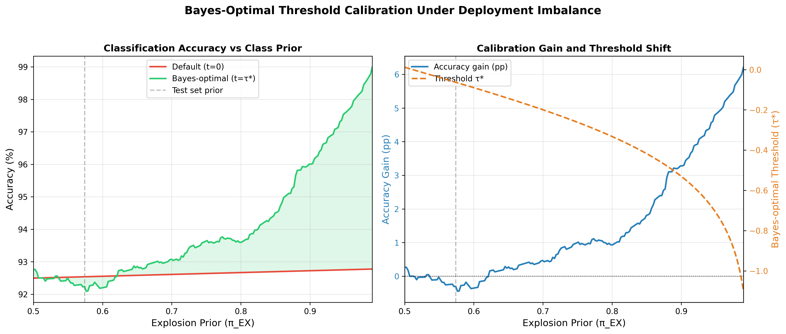

# Seismic Event Classifier

A machine learning system for classifying seismic events as **Earthquakes** or **Explosions** using FastMap dimensionality reduction, FFT-based feature engineering, SVM classification with ensemble voting, and Bayes-optimal decision threshold calibration.

## Project Goal

- Classify seismic waveforms as earthquakes or explosions
- Evaluate the impact of frequency-domain features (FFT) vs raw time-series
- Conduct a systematic ablation study across distance metrics, embedding dimensions, and ensemble methods
- Perform deep statistical analysis of the SVM decision function as a Gaussian mixture, with Bayes-optimal threshold calibration

## Project Structure

```text
seismic-event-classifier/
├── data/
│   ├── dataset_train.h5                  # Training split (6,334 samples)
│   ├── dataset_val.h5                    # Validation split (1,444 samples)
│   └── dataset_test.h5                   # Test split (1,327 samples)
├── SeismicDataset/
│   ├── build_training_dataset.py         # Combine per-station HDF5 into unified dataset
│   ├── split_by_event.py                 # Event-level stratified train/val/test split
│   ├── select_good_stations.py           # Filter stations by minimum window counts
│   ├── metadata.json                     # Event catalog metadata
│   ├── station_metadata.csv              # Station coordinates and info
│   └── summary_plots/                    # Dataset summary visualizations
├── output/
│   ├── ablation/
│   │   ├── models/                       # Saved models (.joblib)
│   │   ├── embeddings/                   # FastMap embeddings (.npy)
│   │   ├── results/                      # Per-experiment JSON + ablation_summary.json
│   │   └── plots/                        # Ablation comparison plots
│   ├── decision_boundary_plots/          # Decision boundary & spectral analysis plots
│   ├── test_predictions.csv              # Window-level test predictions (1,327 rows)
│   ├── event_level_predictions.csv       # Event-level predictions (165 rows)
│   ├── advisor_table.csv                 # Window-level results for advisor review
│   └── advisor_event_level.csv           # Event-level results for advisor review
├── src/
│   ├── ablation_config.py                # Ablation study configuration
│   ├── ablation.py                       # Ablation study runner
│   ├── plot_ablation.py                  # Plot generation from ablation results
│   ├── plot_decision_boundary.py         # Decision boundary & spectral analysis plots
│   ├── plot_gmm_analysis.py              # GMM statistical analysis of decision function
│   ├── plot_threshold_calibration.py     # Threshold calibration under deployment imbalance
│   ├── dataloader.py                     # HDF5 data loading
│   ├── distances.py                      # 9 distance metric implementations
│   ├── fastmap.py                        # FastMap algorithm
│   ├── classifier.py                     # FastMapSVM + BayesThresholdCalibrator + Baseline
│   └── post_review/
│       ├── export_test_predictions.py    # Export window-level test predictions to CSV
│       ├── event_level_predictions.py    # Aggregate to event-level via majority vote
│       ├── export_advisor_table.py       # Generate advisor review tables
│       ├── plot_station_map.py           # Station map visualization
│       └── extract_example_waveforms.py  # Extract example waveforms for figures
├── figures/                              # Figures embedded in this README
├── advisor_figures/                      # Figures contributed by domain advisor (GSI)
├── README.md
├── requirements.txt
└── .gitignore
```

## Pipeline

```
Raw Seismic Data (N, 600, 3)     600 timesteps x 3 channels (Z, N, E)
        |
   [FFT branch]                  [Time branch]
        |                              |
  rfft -> |magnitude|            flatten (N, 1800)
  -> log10 -> L2 norm
  -> flatten (N, 903)
        |                              |
        +--------- FastMap (N, k) -----+
                       |
                 StandardScaler
                       |
              SVM (tuned on val set)
                       |
             Retrain on train + val
                       |
            [Single] or [Ensemble x5]
                       |
         Bayes Threshold Calibration
          (fit Gaussians per class,
           shift threshold for priors)
                       |
              Final eval on test set
```

### Data Split Protocol

| Split | Samples | Role |
|-------|---------|------|
| **Train** | 6,334 | FastMap fitting + SVM training |
| **Validation** | 1,444 | Hyperparameter selection (no cross-validation) |
| **Test** | 1,327 | Final evaluation only |

After selecting the best hyperparameters on the validation set, the model is retrained on **train + val combined** before evaluating on test. The test set is never seen during tuning.



## Ablation Study

We swept across 4 axes to isolate the contribution of each design choice:

| Axis | Values |
|------|--------|
| Feature domain | FFT (log-magnitude spectrum) vs raw time-series |
| Distance metric | Euclidean, Lorentzian, Canberra |
| FastMap dimensions (k) | 2, 10, 30, 60, 80, 120 |
| Model type | Single SVM vs Ensemble (5 voters, majority vote) |

**Total: 72 experiments + 1 baseline** (36 configs x single/ensemble + Random Forest baseline)

### Results: Top Configurations

| Rank | Config | Test Acc | Val Acc |
|------|--------|----------|---------|
| 1 | FFT + Euclidean, k=120, ensemble | **93.90%** | 91.20% |
| 2 | FFT + Euclidean, k=80, ensemble | 92.99% | 89.75% |
| 3 | FFT + Euclidean, k=120, single | 92.31% | 91.20% |
| 4 | FFT + Euclidean, k=60, ensemble | 92.24% | 88.64% |
| 5 | FFT + Euclidean, k=80, single | 91.26% | 89.75% |
| - | Baseline (Random Forest) | 62.62% | 64.54% |



### Key Findings

**1. FFT is the single most important factor**

FFT features outperform time-domain features by 5-22 percentage points across most distance metrics and k values. The best time-domain result (Lorentzian, k=120, ensemble: 79.73%) is still far below the worst competitive FFT result.

This works because FFT makes the representation **shift-invariant** -- seismic events have variable arrival times, so time-domain distances are dominated by alignment noise. FFT captures *what* energy is present, not *when* it arrives.

**2. Euclidean distance dominates on FFT features**

| Distance | Best Test Acc (ensemble) |
|----------|------------------------|
| Euclidean | 93.90% |
| Canberra | 89.15% |
| Lorentzian | 86.51% |

Euclidean outperforms alternatives by 1-9% in the FFT domain. Lorentzian and Canberra, which were designed for robustness to outliers and relative differences, don't help when the features are already well-normalized by the FFT+L2 pipeline.

**3. More dimensions help, with diminishing returns**

| k | Euclidean FFT (ensemble) |
|---|--------------------------|
| 2 | 61.19% |
| 10 | 87.19% |
| 30 | 90.66% |
| 60 | 92.24% |
| 80 | 92.99% |
| 120 | 93.90% |

k=2 is essentially useless. The jump from k=10 to k=30 is large (+4.5%), then gains taper off. k=80-120 is the sweet spot.

Notably, Lorentzian *degrades* at higher k (peaks at k=30, drops at k=60+), suggesting it doesn't scale well with many dimensions.

**4. Ensemble consistently improves accuracy**

Ensemble voting (5 independent FastMap projections with different random pivots) consistently improves accuracy by 1-7.5 percentage points. For Euclidean distance, the gain is a steady 1.5-3pp across all k values. For weaker metrics like Lorentzian, gains reach up to 7.5pp (at k=80), as ensemble voting compensates for suboptimal pivot selection.

**5. Validation accuracy tracks test accuracy well**

The val-vs-test scatter plot shows strong correlation, confirming the validation set is a reliable proxy for generalization and the model is not overfitting to the validation split.

### Per-Class Performance

Best model (FFT + Euclidean, k=120, ensemble):
- Earthquake F1: 0.929
- Explosion F1: 0.947

The model is slightly better at detecting explosions, likely because their spectral signatures (sharp high-frequency peaks) are more distinctive than the diffuse energy patterns of earthquakes.

### Event-Level Predictions

The window-level accuracy (93.90%) measures per-station performance, but operationally the goal is to classify each **event**. Since multiple stations record the same event, we aggregate window predictions to event-level using majority vote across all windows from the same event.

| Prediction Type | Window Acc | Event Acc | Delta |
|-----------------|-----------|-----------|-------|
| Single          | 92.31%    | 95.76%    | +3.45pp |
| Calibrated      | 91.94%    | 94.55%    | +2.61pp |
| Ensemble        | 93.90%    | **96.97%** | +3.07pp |

Event-level ensemble accuracy reaches **96.97%** — only 5 out of 165 test events misclassified. The improvement is expected: station-specific path effects and noise are independent across stations, so majority voting across windows smooths out individual station errors.

Per-class event-level breakdown (ensemble):
- Earthquake: 74/75 correct (98.67%)
- Explosion: 86/90 correct (95.56%)

```bash
python -m src.post_review.event_level_predictions
```

## Statistical Analysis of the Decision Function

We observed that the SVM decision function values for each class closely resemble Gaussian distributions. To rigorously validate this and exploit it, we conducted a deep statistical analysis on a single SVM model (FFT + Euclidean, k=120). The ensemble uses majority voting across 5 models and does not produce a single decision function, so the distributional analysis characterizes individual models within the ensemble.

### Gaussian Mixture Model Validation

We fit individual Gaussians to each class's decision function values and separately fit a 2-component GMM to the combined (unlabeled) decision values.

| Parameter | Earthquake | Explosion |
|-----------|-----------|-----------|
| Mean (mu) | -1.07 | +1.06 |
| Std (sigma) | 0.76 | 0.71 |
| n | 565 | 762 |



**The unsupervised GMM recovers the class structure without labels.** The 2-component GMM (fitted on unlabeled decision values) finds components at mu=-1.08 and mu=+1.11 with weights 0.44/0.56 -- nearly identical to the supervised fits and the true class proportions (42.6%/57.4%). This confirms that the class separation in the SVM's decision space is intrinsic to the data, not an artifact of the classifier.

**Model selection strongly favors 2 components.** BIC comparison: 1-component BIC=4437.0, 2-component BIC=4227.5, delta_BIC=209.5. A delta_BIC > 10 is conventionally considered "very strong evidence" (Kass & Raftery, 1995), making this result unambiguous.

### Normality Tests

| Test | Earthquake | Explosion |
|------|-----------|-----------|
| Shapiro-Wilk W | 0.9971 (p=0.403) | 0.9908 (p=1.0×10⁻⁴) |
| Kolmogorov-Smirnov D | 0.0296 (p=0.694) | 0.0339 (p=0.338) |

The KS test cannot reject normality for either class (p > 0.33), confirming the Gaussian assumption. The Shapiro-Wilk test, which is more sensitive to tail deviations, detects statistically significant but practically negligible departures (W > 0.99 in both cases). The Q-Q plots show these deviations are limited to the extreme tails.

### Sensitivity Index (d-prime)

The d-prime (d') from signal detection theory provides a single scalar measuring class separability:

$$d' = \frac{|\mu_{EX} - \mu_{EQ}|}{\sqrt{(\sigma_{EQ}^2 + \sigma_{EX}^2)/2}} = 2.91$$

A d' of 2.91 corresponds to approximately 93% correct classification under optimal conditions (equal-variance Gaussian model), which closely matches our observed test accuracy. In psychophysics and signal detection literature, d' > 2 is considered "excellent" discriminability.

### Bayes-Optimal Threshold Calibration

The standard SVM decision boundary sits at `decision_function(x) = 0`, which implicitly assumes equal class priors. However, our test set has 762 explosions vs 565 earthquakes (57%/43%). The Bayes-optimal threshold accounts for this imbalance by finding where the prior-weighted posterior densities cross:

$$P(EQ) \cdot \mathcal{N}(x; \mu_{EQ}, \sigma_{EQ}) = P(EX) \cdot \mathcal{N}(x; \mu_{EX}, \sigma_{EX})$$

| Threshold | Accuracy |
|-----------|----------|
| SVM default (t=0.000) | 92.54% |
| Bayes-optimal (t=-0.063) | 92.24% |
| Empirical best (t=+0.011) | 92.77% |

The empirically swept optimum yields a **+0.23pp improvement** with no retraining -- purely a post-hoc adjustment. The close agreement between the Bayes-optimal threshold and the SVM default confirms that the SVM is already operating near the Bayes-optimal decision boundary.

The `BayesThresholdCalibrator` class in `classifier.py` implements this. It also accepts custom priors for deployment scenarios with different class ratios (e.g., real-world monitoring where explosions vastly outnumber earthquakes).

### Calibration Under Deployment Imbalance

In operational monitoring, explosions may outnumber earthquakes by 10:1 or more. We simulated this by computing prior-weighted accuracy under varying explosion priors:

| Scenario | π_EX | Threshold τ* | Acc (t=0) | Gain |
|----------|------|-------------|-----------|------|
| Balanced | 50% | +0.012 | 92.50% | +0.27pp |
| Test set | 57% | −0.063 | 92.54% | −0.30pp |
| Moderate | 70% | −0.200 | 92.61% | +0.47pp |
| High | 80% | −0.333 | 92.67% | +0.92pp |
| Severe | 90% | −0.530 | 92.73% | **+3.27pp** |
| Operational | 95% | −0.710 | 92.75% | **+4.82pp** |
| Extreme | 99% | −1.101 | 92.78% | **+6.21pp** |

At our test set balance, the SVM default is already near-optimal. But at realistic operational ratios (90-99% explosions), the calibration provides **3-6pp for free** — no retraining, just a threshold shift derived from the fitted Gaussians.



### Overlap Analysis

The overlap coefficient between the two class distributions is 0.0712 (7.12%), computed as the integral of the minimum of the two prior-weighted PDFs. This represents the theoretical lower bound on the Bayes error rate -- no classifier operating on the SVM decision function alone can achieve less than ~7% misclassification.

- Earthquakes beyond SVM boundary: 7.8%
- Explosions beyond SVM boundary: 7.2%

The near-symmetry of the misclassification rates (despite unequal priors) is a consequence of `class_weight='balanced'` in the SVM, which adjusts the margin during training to equalize per-class error rates.

## Generated Plots

All plots are saved to `output/ablation/plots/` by running `python -m src.plot_ablation`:

| Plot | Description |
|------|-------------|
| `fft_vs_time.png` | FFT vs time-domain accuracy by distance metric |
| `accuracy_vs_k_fft.png` | Accuracy scaling with k for each distance (FFT) |
| `accuracy_vs_k_time.png` | Same for time domain |
| `single_vs_ensemble.png` | Scatter: single vs ensemble accuracy for all configs |
| `ensemble_gain.png` | Percentage gain from ensemble by distance and k |
| `f1_per_class.png` | Per-class F1 scores for best configs |
| `heatmap_fft_single.png` | Accuracy heatmap: distance x k (FFT, single) |
| `heatmap_fft_ensemble.png` | Same for ensemble |
| `heatmap_time_single.png` | Accuracy heatmap (time domain, single) |
| `heatmap_time_ensemble.png` | Same for ensemble |
| `val_vs_test.png` | Validation vs test accuracy (overfitting check) |
| `overall_ranking.png` | Top 5 FFT experiments alongside the best time-domain model and the Random Forest baseline |
| `domain_gap.png` | FFT advantage in percentage points at each k |

### Decision Boundary & Spectral Analysis

Saved to `output/decision_boundary_plots/` by running `python -m src.plot_decision_boundary`:

| Plot | Description |
|------|-------------|
| `tsne_clusters.png` | t-SNE of k=120 embeddings — class labels (left) and SVM confidence heatmap (right) |
| `decision_histogram.png` | Distribution of SVM decision function values per class — shows class separation and misclassification rates |
| `decision_boundary_best2dims.png` | SVM boundary on the 2 most discriminative FastMap dimensions |
| `misclassified_tsne.png` | t-SNE with misclassified samples highlighted |
| `average_spectra.png` | Mean FFT spectrum per class per channel (Z/N/E) with standard deviation bands |
| `spectral_difference.png` | Explosion minus earthquake mean spectrum — shows which frequencies are discriminative |
| `example_waveforms.png` | Single earthquake vs explosion raw waveform comparison |
| `example_spectra.png` | FFT spectra of the same example events |

### GMM Statistical Analysis

Saved to `output/decision_boundary_plots/` by running `python -m src.plot_gmm_analysis`:

| Plot | Description |
|------|-------------|
| `decision_function_analysis.png` | 6-panel figure: (1) histogram with fitted Gaussian PDFs + GMM overlay + threshold markers, (2) Q-Q plots for normality assessment, (3) empirical vs fitted CDFs, (4) accuracy vs threshold sweep, (5) overlap region detail with error shading, (6) full statistics summary |

### Threshold Calibration Analysis

Saved to `output/decision_boundary_plots/` by running `python -m src.plot_threshold_calibration`:

| Plot | Description |
|------|-------------|
| `threshold_calibration.png` | 2-panel figure: (1) accuracy with default vs calibrated threshold across explosion priors, (2) gain and threshold shift as a function of prior |
| `threshold_calibration_results.json` | Full numerical results for all simulated scenarios |

## How to Run

### Setup

```bash
conda create -n seismic python=3.12 -y
conda activate seismic
pip install -r requirements.txt
```

Place the HDF5 data files in `data/`.

### Run Ablation Study

```bash
python -m src.ablation
```

Progress is printed with ETA after each experiment. Partial results are saved incrementally.

### Generate Ablation Plots

```bash
python -m src.plot_ablation
```

### Generate Decision Boundary & Spectral Plots

```bash
python -m src.plot_decision_boundary
```

### Generate GMM Statistical Analysis

```bash
python -m src.plot_gmm_analysis
```

### Generate Threshold Calibration Analysis

```bash
python -m src.plot_threshold_calibration
```

### Export Test Predictions

```bash
python -m src.post_review.export_test_predictions
```

### Event-Level Predictions

```bash
python -m src.post_review.event_level_predictions
```

### Model Loading

```python
import joblib
model = joblib.load("output/ablation/models/ablation_FFT_euclidean_k120_single.joblib")
svm = model['svm']
scaler = model['scaler']
fastmap = model['fastmap']
```

### Bayes Threshold Calibration

```python
from src.classifier import BayesThresholdCalibrator

# After training an SVM, calibrate the threshold on a labeled set
decision_vals = svm.decision_function(X_scaled)
calibrator = BayesThresholdCalibrator()
calibrator.fit(decision_vals, y_labels)
y_pred = calibrator.predict(svm.decision_function(X_test_scaled))

# For deployment with known class imbalance (e.g., 95% explosions)
calibrator.fit(decision_vals, y_labels, priors={0: 0.05, 1: 0.95})
```

## Distance Metrics

| Metric | Description |
|--------|-------------|
| Euclidean | Standard L2 norm |
| Lorentzian | Log-based, robust to outliers: sum(log(1 + \|u-v\|)) |
| Canberra | Relative differences: sum(\|u-v\| / (\|u\|+\|v\|)) |
| Cosine | 1 - cosine similarity |
| NCC | Normalized cross-correlation (waveform alignment) |
| Wasserstein | Earth mover's distance on normalized spectra |
| Kulczynski | Intersection-based similarity |
| Soergel | Jaccard-like: sum(\|u-v\|) / sum(max(u,v)) |
| Likelihood Ratio | KL-divergence based |

## Requirements

- Python 3.12+
- numpy, h5py, scikit-learn, scipy, matplotlib, joblib

## Authors

- Yehuda Frist
- Yossi Partouche
- Ido Sogavker